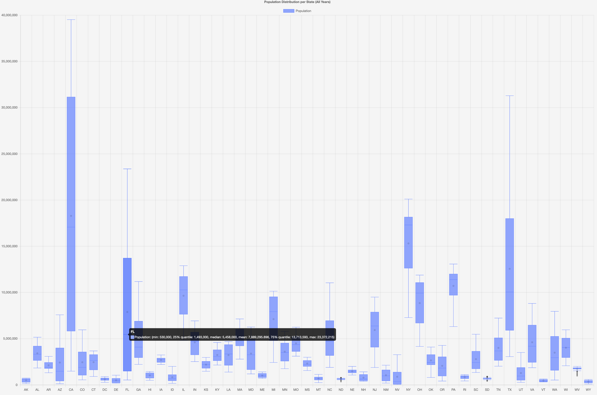

# Box Plot Charts

Box plots visualize the distribution of numerical data through their quartiles, highlighting the median, spread, and outliers. Chart Gizmo's boxplot charts are built on [Chart.js BoxPlot plugin](https://github.com/sgratzl/chartjs-chart-boxplot).



## Basic Usage

```python
from chart_gizmo.boxplot import BoxPlotChart
from H5Gizmos import serve
import numpy as np

chart = BoxPlotChart(title="Monthly Revenue Distribution")
for month in ["Jan", "Feb", "Mar", "Apr", "May", "Jun"]:
    chart.add_label(month)
chart.add_data_values("2023", [np.random.normal(100, 20, 100).tolist() for _ in range(6)], background_color="#3366CC")
chart.add_data_values("2024", [np.random.normal(120, 30, 100).tolist() for _ in range(6)], background_color="#DC3912")
serve(chart.show())
```

## Class: BoxPlotChart

**Location:** `chart_gizmo/boxplot.py`

### Description

A class to represent a box plot chart. Inherits from [`AbstractChart`](../api/charts.md).

### Constructor Parameters

- `configuration`: Chart.js configuration (optional)
- `width`: Chart width in pixels (default: 600)
- `height`: Chart height in pixels (default: 400)
- `options`: Additional chart options (optional)
- `title`: Chart title (optional)
- `stacked`: Whether to stack boxplots (default: False)
- `animate` (bool): Enable or disable animations. Default is `False` (no animation). Controlled by the symbolic constant `ANIMATION_DEFAULT`.

### Key Methods

- `add_label(label)`: Add a label to the chart (e.g., x-axis category)
- `add_data_values(label, values, background_color=None, border_color=None, border_width=1, ...)`: Add a dataset of boxplot values. `values` should be a list of arrays (one per label), or a list of lists.
- `get_configuration()`: Get the chart configuration.
- `saveImage(filepath)`: Save the chart as a PNG image file (async, must be awaited).

## Class: CSVBoxPlotChart

**Location:** `chart_gizmo/boxplot.py`

### Description

Create a boxplot chart from a CSV file. Supports classic and grouped boxplots.

### Constructor Parameters

- `csv_file`: Path to the CSV file
- `columns`: List of columns to include as boxes (default: all except group column)
- `group_column`: Name of the column to group by (optional)
- `width`: Chart width in pixels (default: 600)
- `height`: Chart height in pixels (default: 400)
- `title`: Chart title (optional)
- `animate` (bool): Enable or disable animations. Default is `False` (no animation). Controlled by the symbolic constant `ANIMATION_DEFAULT`.

### Example: Classic Boxplot from CSV

```python
from chart_gizmo.boxplot import CSVBoxPlotChart
from H5Gizmos import serve

chart = CSVBoxPlotChart(
    csv_file="data/data.csv",
    columns=["Amount", "Score"]
)
serve(chart.show())
```

### Example: Grouped Boxplot from CSV

```python
from chart_gizmo.boxplot import CSVBoxPlotChart
from H5Gizmos import serve

chart = CSVBoxPlotChart(
    csv_file="data/data.csv",
    columns=["Amount"],
    group_column="Year",
    title="Box Plot Example",
)
serve(chart.show())
```

## See Also

- [Boxplot Chart CLI](../cli/boxplot.md)
- [AbstractChart API](charts.md)
