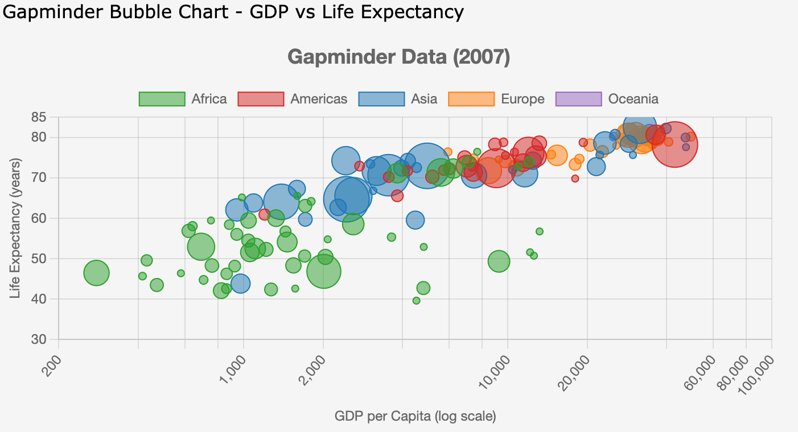

# Bubbles

The `BubbleChart` and related classes provide bubble chart functionality based on [Chart.js Bubble Charts](https://www.chartjs.org/docs/latest/charts/bubble.html).



## Basic Usage

```python
from chart_gizmo.bubbles import BubbleChart
from H5Gizmos import serve

# Create a bubble chart with tooltips and labels
chart = BubbleChart(width=600, height=400, title="Population vs. Cost of Living")

# Add bubble data values (list of dicts with x, y, r, label, tooltip)
chart.add_data_values("West Coast", [
    {"x": 10, "y": 20, "r": 8, "label": "San Francisco", "tooltip": "San Francisco: High tech hub"},
    {"x": 25, "y": 15, "r": 12, "label": "Los Angeles", "tooltip": "LA: Entertainment capital"},
    {"x": 40, "y": 30, "r": 6, "label": "Portland", "tooltip": "Portland: Rose City"}
], background_color="rgba(54, 162, 235, 0.5)")

chart.add_data_values("East Coast", [
    {"x": 15, "y": 25, "r": 10, "label": "New York", "tooltip": "NYC: Financial center"},
    {"x": 30, "y": 18, "r": 7, "label": "Boston", "tooltip": "Boston: Academic hub"},
], background_color="rgba(255, 99, 132, 0.5)")

# Display the chart
serve(chart.show())
```

## Class: BubbleChart

**Location:** `chart_gizmo/bubbles.py`

### Description

A class to represent a bubble chart. Inherits from [`AbstractChart`](../api/charts.md).

### Constructor Parameters

- `configuration`: Chart data configuration
- `width`: Chart width in pixels (default: 400)
- `height`: Chart height in pixels (default: 400)
- `stacked`: Whether the chart is stacked (not used for bubble charts)
- `options`: Additional chart options
- `title`: Chart title
- `r_column`: Column for radius values
- `x_column`: Column for x-axis values
- `y_column`: Column for y-axis values
- `group_column`: Column for grouping data
- `min_radius`: Minimum radius for bubbles (default: 5)
- `max_radius`: Maximum radius for bubbles (default: 20)
- `animate`(bool): Enable or disable animations. Default is `False` (no animation). Controlled by the symbolic constant `ANIMATION_DEFAULT`.

### Key Methods

- `add_data_values(label, values, background_color=None, border_color=None, border_width=1)`: Add data values to the chart.

  - `label`: The dataset label
  - `values`: List of data points. Each data point is a dictionary with:
    - `x`: x-coordinate value
    - `y`: y-coordinate value
    - `r`: radius value
    - `label` (optional): Text label to display on the bubble
    - `tooltip` (optional): Custom tooltip text for the bubble
  - `background_color`: Background color for bubbles
  - `border_color`: Border color for bubbles
  - `border_width`: Border width for bubbles

- `get_default_options()`: Get the default options for the bubble chart.
- `saveImage(filepath)`: Save the chart as a PNG image file. This is an async method and must be used with `await`.

## Class: CSVBubbleChart

**Location:** `chart_gizmo/bubbles.py`

### Description

Loads a CSV and creates a bubble chart.

### Constructor Parameters

All parameters from `BubbleChart`, plus:

- `csv_file`: Path to the CSV file
- `bubble_label_column`: Column to use for bubble labels
- `tooltip_columns`: **List of columns to use for tooltip content.** Accepts a list of column names (space-separated or comma-separated).
- `animate`: Enable or disable animations (default: `False`)

### Example

```python
from chart_gizmo.bubbles import CSVBubbleChart
from H5Gizmos import serve

# Create a bubble chart from CSV data
chart = CSVBubbleChart(
    csv_file="gapminderDataFiveYear.csv",
    x_column="gdpPercap",
    y_column="lifeExp",
    r_column="pop",
    group_column="continent",
    width=900,
    height=600,
    min_radius=3,
    max_radius=20,
    title="GDP vs Life Expectancy",
    tooltip_columns=["country", "year"],  # Multiple columns for tooltip
    bubble_label_column="country"
)

# Display the chart
serve(chart.show())
```

### Command-line Script

The module provides a command-line interface for creating bubble charts from CSV files.

See the [Bubble Chart CLI documentation](../cli/bubble.md) for detailed usage instructions on the command-line tool.
