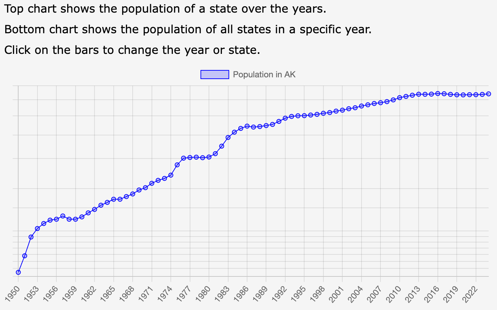

# Lines

The `LineChart` and related classes provide line chart functionality based on [Chart.js Line Charts](https://www.chartjs.org/docs/latest/charts/line.html).



## Basic Usage

```python
from chart_gizmo.lines import LineChart
from H5Gizmos import serve

# Create a line chart for monthly temperature data
chart = LineChart()

# Add month labels
chart.add_label("Jan")
chart.add_label("Feb")
chart.add_label("Mar")
chart.add_label("Apr")
chart.add_label("May")
chart.add_label("Jun")

# Add temperature data for two cities
chart.add_data_values("New York", [3, 4, 8, 15, 21, 26],
                      background_color="rgba(54, 162, 235, 0.2)",
                      border_color="rgba(54, 162, 235, 1)")
chart.add_data_values("San Francisco", [12, 13, 14, 15, 16, 17],
                      background_color="rgba(255, 99, 132, 0.2)",
                      border_color="rgba(255, 99, 132, 1)")

# Display the chart
serve(chart.show())
```

## Class: LineChart

**Location:** `chart_gizmo/lines.py`

### Description

A class to represent a line chart. Inherits from `AbstractChart`.

### Key Methods

- `add_label(label, values=())`: Add a label to the chart.
- `add_dataset(dataset)`: Add a dataset to the chart.
- `add_data_values(label, values=(), background_color=None, border_color=None, border_width=1)`: Add data values to the chart.
- `get_configuration()`: Get the chart configuration.
- `saveImage(filepath)`: Save the chart as a PNG image file. This is an async method and must be used with `await`.

## Class: CSVLineChart

**Location:** `chart_gizmo/lines.py`

### Description

Create a line chart from a CSV file. Inherits from `CSVBarChart`.

### Constructor Parameters

- `csv_file`: Path to the CSV file
- `label_column`: Name of the column to use for x-axis labels
- `value_column`: Name of the column to use for y-axis values
- `group_column`: Name of the column to use for grouping (optional)
- `width`: Chart width in pixels (default: 400)
- `height`: Chart height in pixels (default: 400)
- `stacked`: Whether to use stacked lines (default: False)
- `configuration`: Chart.js configuration (optional)
- `options`: Additional chart options (optional)
- `title`: Chart title (optional)

### Example

```python
from chart_gizmo.lines import CSVLineChart
from H5Gizmos import serve

chart = CSVLineChart(
    csv_file="data.csv",
    label_column="Month",
    value_column="Temperature",
    group_column="City",
    width=800,
    height=400,
    stacked=False,
    title="Monthly Temperatures"
)
serve(chart.show())
```

### Command-line Script

- `CSVLineChartScript()`: Command-line entrypoint for CSVLineChart.

See the [Line Chart CLI documentation](../cli/line.md) for detailed usage instructions on the command-line tool.
